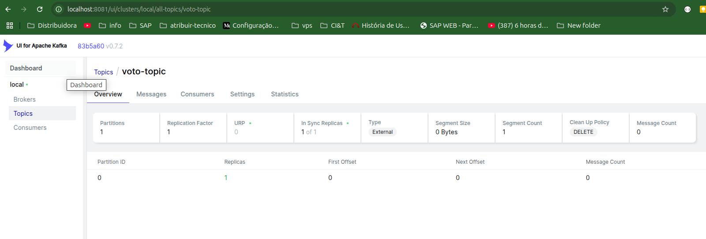

## Projeto votação de assembleia

## Tecnologia utilizadas
- Java 
- Spring boot
- Mysql
- Docker
- Kafka
- Kafka UI
- Zookeeper

## Diagrama Entidade Realiocnamento


## System Design


## Startar o projeto

- Na raiz do projeto execute o camando abaixo:
```
docker compose build
docker compose up
```

### Realizar testes via swagger

Você pode acessar a documentação da API através do Swagger UI no seguinte link:

[Swagger UI](http://localhost:8080/swagger-ui/index.html#/)


### Acessar o topico do kafka

- Para visualizar as mensagens publicada no kafka

[Kafka UI](http://localhost:8081/ui/clusters/local/all-topics/voto-topic)




### Passos para execução dos teste

- Criar uma Pauta;
- Criar uma Sessão;
- Registrar Voto
- Schedule a cada um minutos fechar as sessões abertas e que a data fim expirada; 
- Schedule public no topico o resultado da votação;
